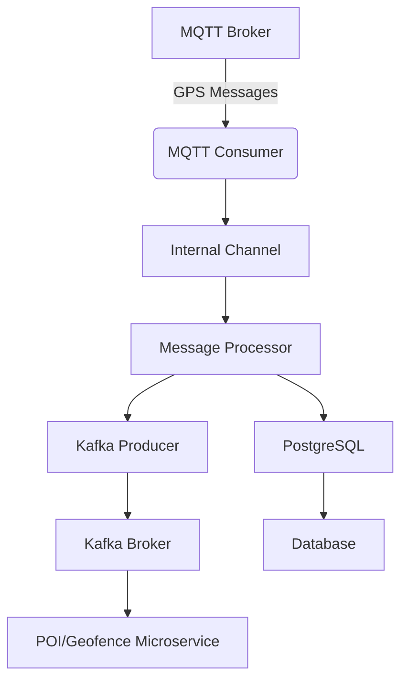

# Tracking Consumer Rust

High-performance MQTT to Kafka consumer for GPS tracking data processing.

## Features

- 🚀 **High Performance**: 5-10x faster than Python version
- 🔄 **Async Processing**: True parallel processing with Tokio
- 🛡️ **Type Safety**: Compile-time error prevention
- 📊 **Real-time**: POI and Geofence processing
- 🔌 **Reliable**: Auto-reconnection for MQTT and Kafka
- 📈 **Scalable**: Handles thousands of messages per second

## Quick Start

```bash
# 1. Clone and build
cargo build --release

# 2. Set environment variables
export BROKER_HOST="localhost"
export BROKER_TOPIC="tracking/data"
export DB_HOST="localhost"
export DB_PORT="5432"
export DB_DATABASE="tracking"
export DB_USERNAME="user"
export DB_PASSWORD="password"
export RUST_LOG="info"
# ... (see Configuration section for all variables)

# 3. Run
cargo run --release
```

## Architecture

```
MQTT → Consumer → Kafka + PostgreSQL
```

## How It Works

**Tracking Consumer Rust** is a high-performance service designed to consume GPS tracking data from an MQTT broker and forward the raw data to Kafka and PostgreSQL for further use and analytics. The logic for Points of Interest (POI) and Geofence evaluation is handled by a separate microservice that consumes from Kafka.

### Execution Flow

1. **Startup & Configuration**
   - Loads configuration from environment variables.
   - Initializes logging and prepares for graceful shutdown.

2. **Service Initialization**
   - Connects to PostgreSQL (for persistent storage).
   - Configures the Kafka producer (for streaming data).
   - Sets up the MQTT consumer (to receive GPS messages).
   - Initializes the message processor (handles batching and dispatch).

3. **Main Processing Loop**
   - Starts the MQTT consumer in the background, which receives messages and pushes them to an internal channel.
   - The message processor consumes messages from the channel and batches results.
   - Data is sent to Kafka and PostgreSQL.
   - Health checks and statistics are periodically logged.

4. **Graceful Shutdown**
   - On receiving a shutdown signal, the application flushes all buffers, closes Kafka and MQTT connections, and ensures all data is persisted.

### Execution Diagram



## Performance

- **Throughput**: 1000-5000 msg/s
- **Memory**: ~10-20 MB
- **Latency**: <10ms processing time
- **CPU**: ~5-15% on modern hardware

## Configuration

The application is configured entirely through environment variables. No configuration files are needed.

### Required Environment Variables

#### MQTT/Broker Configuration
- `BROKER_HOST` - MQTT broker hostname or IP. Can include port (e.g., "broker.example.com:1883" or "192.168.1.10")
- `BROKER_TOPIC` - MQTT topic to subscribe to (e.g., "tracking/data")
- `BROKER_TYPE` - Broker type (e.g., "mqtt")
- `MQTT_PORT` - MQTT port (default: 1883). Only needed if BROKER_HOST doesn't include port
- `MQTT_USERNAME` - MQTT username (optional)
- `MQTT_PASSWORD` - MQTT password (optional)
- `MQTT_CLIENT_ID` - MQTT client ID (default: "siscom-consumer-rust")
- `MQTT_KEEP_ALIVE_SECS` - Keep alive interval in seconds (default: 60)
- `MQTT_CLEAN_SESSION` - Clean session flag (default: true)
- `MQTT_MAX_RECONNECT_ATTEMPTS` - Max reconnection attempts (default: 10)

#### Kafka Configuration
- `KAFKA_ENABLED` - Enable/disable Kafka (default: false)
- `KAFKA_BROKERS` - Comma-separated list of Kafka brokers (e.g., "localhost:9092")
- `KAFKA_POSITION_TOPIC` - Kafka topic for position data
- `KAFKA_NOTIFICATIONS_TOPIC` - Kafka topic for notifications
- `KAFKA_BATCH_SIZE` - Batch size for Kafka producer (default: 100)
- `KAFKA_BATCH_TIMEOUT_MS` - Batch timeout in milliseconds (default: 100)
- `KAFKA_COMPRESSION` - Compression type (e.g., "snappy")
- `KAFKA_RETRIES` - Number of retries (default: 3)

#### Database Configuration
- `DB_HOST` - PostgreSQL hostname
- `DB_PORT` - PostgreSQL port (default: 5432)
- `DB_DATABASE` - Database name
- `DB_USERNAME` - Database username
- `DB_PASSWORD` - Database password
- `DB_MAX_CONNECTIONS` - Maximum connections (default: 20)
- `DB_MIN_CONNECTIONS` - Minimum connections (default: 5)
- `DB_CONNECTION_TIMEOUT_SECS` - Connection timeout (default: 30)
- `DB_IDLE_TIMEOUT_SECS` - Idle timeout (default: 600)

#### Processing Configuration
- `PROCESSING_WORKER_THREADS` - Number of worker threads (default: 4)
- `PROCESSING_MESSAGE_BUFFER_SIZE` - Message buffer size (default: 10000)
- `PROCESSING_BATCH_PROCESSING_SIZE` - Batch processing size (default: 100)
- `PROCESSING_MAX_PARALLEL_DEVICES` - Max parallel devices (default: 50)

#### Logging Configuration
- `RUST_LOG` - Log level (e.g., "info", "debug", "warn", "error")
- `LOGGING_FILE_PATH` - Log file path (optional)
- `LOGGING_MAX_FILE_SIZE_MB` - Max log file size in MB (default: 100)
- `LOGGING_MAX_FILES` - Max number of log files (default: 10)
- `LOGGING_JSON_FORMAT` - Use JSON format for logs (default: true)

### Disabling Kafka

To disable Kafka and use only PostgreSQL + MQTT:

```bash
export KAFKA_ENABLED=false
```

- If `KAFKA_ENABLED=false`, the application will work only with PostgreSQL and MQTT.
- If `KAFKA_ENABLED=true`, Kafka configuration will be validated and required.

## Development

```bash
# Run tests
cargo test

# Run with logs
RUST_LOG=debug cargo run

# Format code
cargo fmt

# Check code
cargo clippy
```
