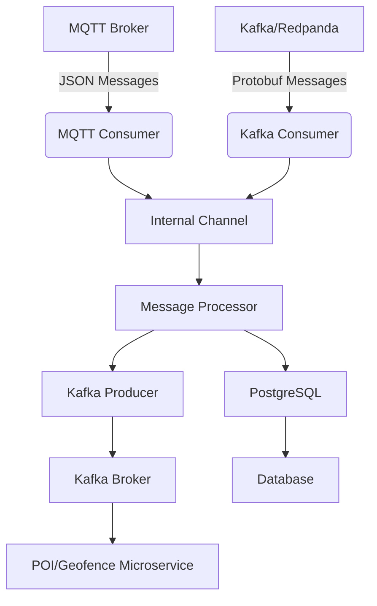

# SISCOM Consumer Rust

High-performance MQTT/Kafka consumer for GPS tracking data processing with Protobuf support.

[](https://www.rust-lang.org/)
[](https://www.docker.com/)
[](LICENSE)

## Features

- 🚀 **High Performance**: 5-10x faster than Python version
- 🔄 **Async Processing**: True parallel processing with Tokio
- 🛡️ **Type Safety**: Compile-time error prevention
- 📊 **Real-time**: POI and Geofence processing
- 🔌 **Reliable**: Auto-reconnection for MQTT and Kafka
- 📈 **Scalable**: Handles thousands of messages per second
- 🔧 **Flexible**: Support for both MQTT and Kafka brokers
- 📦 **Protocol Buffers**: Native Protobuf support for Kafka messages

## Quick Start

```bash
# 1. Clone and build
cargo build --release

# 2. Set environment variables

## For MQTT (default):
export BROKER_TYPE="mqtt"
export BROKER_HOST="tcp://localhost:1883"
export BROKER_TOPIC="siscom-messages"

## For Kafka/Redpanda:
export BROKER_TYPE="kafka"
export BROKER_HOST="localhost:9092"
export BROKER_TOPIC="siscom-messages"

## Database:
export DB_HOST="localhost"
export DB_PORT="5432"
export DB_DATABASE="tracking"
export DB_USERNAME="user"
export DB_PASSWORD="password"
export RUST_LOG="info"
# ... (see Configuration section for all variables)

# 3. Run
cargo run --release
```

## Architecture

```
MQTT/Kafka → Consumer → Kafka + PostgreSQL
```

The consumer can read from either:
- **MQTT**: Traditional MQTT broker (Mosquitto, etc.)
- **Kafka/Redpanda**: Modern streaming platform with Protobuf-encoded messages

## How It Works

**Tracking Consumer Rust** is a high-performance service designed to consume GPS tracking data from either an MQTT broker or Kafka/Redpanda streaming platform and forward the raw data to Kafka and PostgreSQL for further use and analytics. The logic for Points of Interest (POI) and Geofence evaluation is handled by a separate microservice that consumes from Kafka.

The consumer supports two input methods:
- **MQTT Mode**: Traditional MQTT broker integration with JSON messages
- **Kafka Mode**: Modern streaming platform with Protocol Buffer messages

### Execution Flow

1. **Startup & Configuration**
   - Loads configuration from environment variables.
   - Initializes logging and prepares for graceful shutdown.

2. **Service Initialization**
   - Connects to PostgreSQL (for persistent storage).
   - Configures the Kafka producer (for streaming data).
   - Sets up the MQTT consumer (to receive GPS messages).
   - Initializes the message processor (handles batching and dispatch).

3. **Main Processing Loop**
   - Starts the MQTT consumer in the background, which receives messages and pushes them to an internal channel.
   - The message processor consumes messages from the channel and batches results.
   - Data is sent to Kafka and PostgreSQL.
   - Health checks and statistics are periodically logged.

4. **Graceful Shutdown**
   - On receiving a shutdown signal, the application flushes all buffers, closes Kafka and MQTT connections, and ensures all data is persisted.

### Execution Diagram



## Performance

- **Throughput**: 1000-5000 msg/s
- **Memory**: ~10-20 MB
- **Latency**: <10ms processing time
- **CPU**: ~5-15% on modern hardware

## Configuration

The application is configured entirely through environment variables. A template file `.env.template` is provided with all available options and examples.

### Quick Setup

1. **Copy the template:**
   ```bash
   cp .env.template .env
   ```

2. **Edit `.env` with your values:**
   ```bash
   # Edit the .env file with your preferred editor
   nano .env
   ```

3. **Run with environment file:**
   ```bash
   # Option 1: Source the .env file
   set -a && source .env && set +a && cargo run --release

   # Option 2: Use a tool like dotenv
   # (The application reads from environment variables directly)
   ```

### Required Environment Variables

#### Broker Configuration (Choose one mode)
- `BROKER_TYPE` - **Required**. Broker type: `"mqtt"` or `"kafka"`
- `BROKER_HOST` - **Required**. Broker connection string
  - For MQTT: `tcp://host:port` (e.g., `tcp://localhost:1883`)
  - For Kafka: `host:port` (e.g., `localhost:9092` or `redpanda:9092`)
- `BROKER_TOPIC` - **Required**. Topic to consume from (default: `siscom-messages`)

#### MQTT Configuration (when BROKER_TYPE=mqtt)
- `MQTT_USERNAME` - MQTT username (optional)
- `MQTT_PASSWORD` - MQTT password (optional)
- `MQTT_CLIENT_ID` - Client ID (default: `siscom-consumer-rust`)
- `MQTT_KEEP_ALIVE_SECS` - Keep alive interval (default: 60)
- `MQTT_CLEAN_SESSION` - Clean session flag (default: true)
- `MQTT_MAX_RECONNECT_ATTEMPTS` - Max reconnection attempts (default: 10)

#### Kafka Configuration (when BROKER_TYPE=kafka)
- `KAFKA_BATCH_SIZE` - Batch size for producer (default: 100)
- `KAFKA_BATCH_TIMEOUT_MS` - Batch timeout in ms (default: 100)
- `KAFKA_COMPRESSION` - Compression type: `snappy`, `gzip`, etc. (default: snappy)
- `KAFKA_RETRIES` - Number of retries (default: 3)
- `KAFKA_SECURITY_PROTOCOL` - Security protocol (e.g., `SASL_PLAINTEXT`, `SASL_SSL`)
- `KAFKA_SASL_MECHANISM` - SASL mechanism (e.g., `SCRAM-SHA-256`, `PLAIN`)
- `KAFKA_USERNAME` - SASL username for authentication
- `KAFKA_PASSWORD` - SASL password for authentication

#### Database Configuration
- `DB_HOST` - PostgreSQL hostname
- `DB_PORT` - PostgreSQL port (default: 5432)
- `DB_DATABASE` - Database name
- `DB_USERNAME` - Database username
- `DB_PASSWORD` - Database password
- `DB_MAX_CONNECTIONS` - Maximum connections (default: 20)
- `DB_MIN_CONNECTIONS` - Minimum connections (default: 5)
- `DB_CONNECTION_TIMEOUT_SECS` - Connection timeout (default: 30)
- `DB_IDLE_TIMEOUT_SECS` - Idle timeout (default: 600)

#### Processing Configuration
- `PROCESSING_WORKER_THREADS` - Number of worker threads (default: 4)
- `PROCESSING_MESSAGE_BUFFER_SIZE` - Message buffer size (default: 10000)
- `PROCESSING_BATCH_PROCESSING_SIZE` - Batch processing size (default: 100)
- `PROCESSING_MAX_PARALLEL_DEVICES` - Max parallel devices (default: 50)

#### Logging Configuration
- `RUST_LOG` - Log level (e.g., "info", "debug", "warn", "error")
- `LOGGING_FILE_PATH` - Log file path (optional)
- `LOGGING_MAX_FILE_SIZE_MB` - Max log file size in MB (default: 100)
- `LOGGING_MAX_FILES` - Max number of log files (default: 10)
- `LOGGING_JSON_FORMAT` - Use JSON format for logs (default: true)

### Broker Modes

#### MQTT Mode (Traditional)
```bash
export BROKER_TYPE=mqtt
export BROKER_HOST=tcp://localhost:1883
export BROKER_TOPIC=siscom-messages
```
- Connects to MQTT brokers (Mosquitto, HiveMQ, etc.)
- Consumes JSON messages from MQTT topics
- Maintains backward compatibility with existing deployments

#### Kafka Mode (Modern Streaming)
```bash
export BROKER_TYPE=kafka
export BROKER_HOST=localhost:9092
export BROKER_TOPIC=siscom-messages
```
- Connects to Kafka/Redpanda streaming platforms
- Consumes Protocol Buffer messages from Kafka topics
- Higher throughput and better scalability for large deployments

### Message Formats

#### MQTT Messages (JSON)
```json
{
  "data": {
    "device_id": "ABC123",
    "latitude": -12.0464,
    "longitude": -77.0428,
    "speed": 45.2,
    "course": 180.0
  },
  "decoded": { "suntech_raw": { ... } },
  "metadata": { ... },
  "uuid": "uuid-string",
  "raw": "original message"
}
```

#### Kafka Messages (Protobuf)
Messages follow the `siscom.proto` schema with fields for:
- Device identification and location data
- Normalized/homogenized tracking information
- Vendor-specific decoded data (Suntech/Queclink)
- Message metadata (timestamps, client info)

📖 **Para información detallada sobre serialización y deserialización, consulte [docs/serialization-guide.md](docs/serialization-guide.md)**

## Development

### Environment Setup

1. **Install Rust:**
   ```bash
   curl --proto '=https' --tlsv1.2 -sSf https://sh.rustup.rs | sh
   source $HOME/.cargo/env
   ```

2. **Clone and setup:**
   ```bash
   git clone <repository-url>
   cd siscom-consumer
   cp .env.template .env
   # Edit .env with your configuration
   ```

3. **Build and run:**
   ```bash
   # Build
   cargo build --release

   # Run with debug logs
   RUST_LOG=debug cargo run

   # Run tests
   cargo test

   # Format code
   cargo fmt

   # Check code quality
   cargo clippy
   ```

### Docker Development

#### Using Docker Compose

The project includes a complete Docker Compose setup with infrastructure services:

**For MQTT mode:**
```bash
# Copy and edit environment
cp .env.template .env
# Edit .env to set BROKER_TYPE=mqtt

# Run with MQTT infrastructure
docker-compose --profile mqtt up

# Or run only the application (if you have external MQTT)
docker-compose run --rm siscom-consumer
```

**For Kafka mode:**
```bash
# Copy and edit environment
cp .env.template .env
# Edit .env to set BROKER_TYPE=kafka

# Run with Kafka (Redpanda) infrastructure
docker-compose --profile kafka up
```

**Available services:**
- `siscom-consumer`: Main application
- `postgres`: PostgreSQL database
- `mosquitto`: MQTT broker (MQTT profile)
- `redpanda`: Kafka-compatible streaming platform (Kafka profile)

#### Manual Docker Usage

```bash
# Build container
docker build -t siscom-consumer .

# Run with environment file
docker run --env-file .env siscom-consumer

# Run with specific environment variables
docker run -e BROKER_TYPE=mqtt -e BROKER_HOST=host.docker.internal:1883 siscom-consumer
```

### Configuration Examples

#### Local Development (MQTT)
```bash
export BROKER_TYPE=mqtt
export BROKER_HOST=tcp://localhost:1883
export BROKER_TOPIC=test-messages
export DB_HOST=localhost
export DB_DATABASE=tracking_dev
export RUST_LOG=debug
```

#### Docker with Kafka
```bash
export BROKER_TYPE=kafka
export BROKER_HOST=redpanda:9092
export BROKER_TOPIC=siscom-messages
export DB_HOST=postgres
export DB_DATABASE=tracking
export RUST_LOG=info
```

#### Production Setup
```bash
export BROKER_TYPE=kafka
export BROKER_HOST=kafka-cluster.company.com:9092
export BROKER_TOPIC=tracking-events
export DB_HOST=postgres-prod.company.com
export DB_DATABASE=tracking_prod
export RUST_LOG=warn
```

#### Production Setup with SASL Authentication
```bash
export BROKER_TYPE=kafka
export BROKER_HOST=kafka-cluster.company.com:9092
export BROKER_TOPIC=tracking-events
export KAFKA_SECURITY_PROTOCOL=SASL_PLAINTEXT
export KAFKA_SASL_MECHANISM=SCRAM-SHA-256
export KAFKA_USERNAME=siscom-consumer
export KAFKA_PASSWORD=your-secure-password
export DB_HOST=postgres-prod.company.com
export DB_DATABASE=tracking_prod
export RUST_LOG=warn
```

## Migration Guide

### From MQTT-only to Kafka

1. **Update environment variables:**
   ```bash
   # Old configuration
   export MQTT_BROKER=localhost
   export MQTT_PORT=1883
   export MQTT_TOPIC=tracking/data

   # New configuration
   export BROKER_TYPE=kafka
   export BROKER_HOST=localhost:9092
   export BROKER_TOPIC=siscom-messages
   ```

2. **Update message producers** to send Protobuf messages according to `siscom.proto`

3. **Test thoroughly** in staging environment before production deployment

### Backward Compatibility

- **MQTT legacy variables** (`MQTT_*`) are still supported but deprecated
- **Old configuration format** continues to work
- **Database schema** remains unchanged
- **API contracts** maintain compatibility

### Troubleshooting

#### Common Issues

**"Unknown broker type" error:**
- Check that `BROKER_TYPE` is set to either `"mqtt"` or `"kafka"`
- Values are case-sensitive

**"Connection refused" for Kafka:**
- Verify Kafka brokers are running and accessible
- Check network connectivity and firewall rules
- Ensure topic exists: `kafka-topics --create --topic siscom-messages --bootstrap-server localhost:9092`

**Protobuf decode errors:**
- Verify message format matches `siscom.proto` schema
- Check message serialization in producer applications
- Enable debug logging: `RUST_LOG=debug`

#### Monitoring

The application provides health checks and metrics:

- **Health endpoint:** Application logs connection status every 30 seconds
- **Metrics:** DB buffer size, Kafka buffer size, batch statistics logged every 60 seconds
- **Logs:** Structured JSON logs (configurable) with detailed error information

## Contributing

1. **Fork the repository**
2. **Create a feature branch:** `git checkout -b feature/amazing-feature`
3. **Make your changes** and add tests
4. **Run tests:** `cargo test`
5. **Format code:** `cargo fmt && cargo clippy`
6. **Commit your changes:** `git commit -m 'Add amazing feature'`
7. **Push to the branch:** `git push origin feature/amazing-feature`
8. **Open a Pull Request**

### Code Standards

- **Rust Edition:** 2021
- **Formatting:** `cargo fmt`
- **Linting:** `cargo clippy`
- **Testing:** `cargo test` with >80% coverage
- **Documentation:** All public APIs documented
- **Error Handling:** Use `anyhow` for application errors, `thiserror` for library errors

## Documentation

### Message Serialization Guide

Para desarrolladores que necesiten integrar con el sistema SISCOM Consumer, consulte la guía completa de serialización:

📖 **[Guía de Serialización y Deserialización](docs/serialization-guide.md)**

Esta guía incluye:
- Esquema completo de Protocol Buffers
- Ejemplos de serialización en múltiples lenguajes (Rust, Python, JavaScript)
- Formatos de mensajes para dispositivos Suntech y Queclink
- Integración con Apache Kafka
- Validaciones y mejores prácticas

## Deployment

### Production Considerations

#### Environment Variables
- Use Docker secrets or Kubernetes secrets for sensitive data
- Set `RUST_LOG=warn` or `RUST_LOG=error` in production
- Configure proper database connection pooling

#### Monitoring & Observability
- Enable JSON logging: `LOGGING_JSON_FORMAT=true`
- Configure log aggregation (ELK, Loki, etc.)
- Set up health checks and metrics collection
- Monitor Kafka consumer lag and database connections

#### Performance Tuning
```bash
# High-throughput settings
export PROCESSING_MESSAGE_BUFFER_SIZE=50000
export PROCESSING_BATCH_PROCESSING_SIZE=500
export PROCESSING_WORKER_THREADS=8
export DB_MAX_CONNECTIONS=50

# Kafka optimization
export KAFKA_BATCH_SIZE=1000
export KAFKA_BATCH_TIMEOUT_MS=50
```

#### Security
- Use authentication for MQTT brokers in production
- Configure TLS for all connections
- Use managed databases with proper security groups
- Rotate credentials regularly

### Kubernetes Deployment

Example deployment manifest:
```yaml
apiVersion: apps/v1
kind: Deployment
metadata:
  name: siscom-consumer
spec:
  replicas: 3
  template:
    spec:
      containers:
      - name: siscom-consumer
        image: siscom-consumer:latest
        envFrom:
        - secretRef:
            name: siscom-secrets
        resources:
          requests:
            memory: "256Mi"
            cpu: "100m"
          limits:
            memory: "512Mi"
            cpu: "500m"
```

## License

This project is licensed under the MIT License - see the [LICENSE](LICENSE) file for details.
