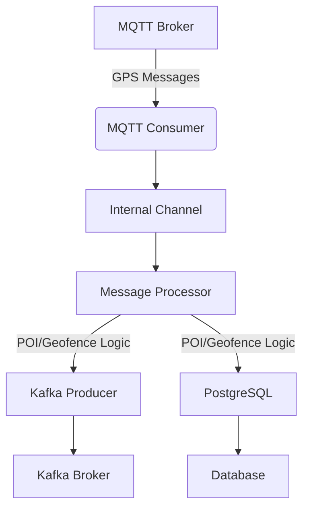

# Tracking Consumer Rust

High-performance MQTT to Kafka consumer for GPS tracking data processing.

## Features

- 🚀 **High Performance**: 5-10x faster than Python version
- 🔄 **Async Processing**: True parallel processing with Tokio
- 🛡️ **Type Safety**: Compile-time error prevention
- 📊 **Real-time**: POI and Geofence processing
- 🔌 **Reliable**: Auto-reconnection for MQTT and Kafka
- 📈 **Scalable**: Handles thousands of messages per second

## Quick Start

```bash
# 1. Clone and build
cargo build --release

# 2. Copy and configure
cp .env.template .env
# Edit .env with your settings

# 3. Run
cargo run --release
```

## Architecture

```
MQTT → Consumer → Processor → [POI/Geofence Logic] → Kafka + PostgreSQL
```

## How It Works

**Tracking Consumer Rust** is a high-performance service designed to consume GPS tracking data from an MQTT broker, process it (including POI and Geofence logic), and forward the results to Kafka and PostgreSQL for further use and analytics.

### Execution Flow

1. **Startup & Configuration**
   - Loads configuration from `config/app.toml` or environment.
   - Initializes logging and prepares for graceful shutdown.

2. **Service Initialization**
   - Connects to PostgreSQL (for persistent storage).
   - Configures the Kafka producer (for streaming processed data).
   - Sets up the MQTT consumer (to receive GPS messages).
   - Initializes the message processor (handles business logic, batching, and dispatch).

3. **Main Processing Loop**
   - Starts the MQTT consumer in the background, which receives messages and pushes them to an internal channel.
   - The message processor consumes messages from the channel, applies POI and Geofence logic, and batches results.
   - Processed data is sent to Kafka and PostgreSQL.
   - Health checks and statistics are periodically logged.

4. **Graceful Shutdown**
   - On receiving a shutdown signal, the application flushes all buffers, closes Kafka and MQTT connections, and ensures all data is persisted.

### Execution Diagram



## Performance

- **Throughput**: 1000-5000 msg/s
- **Memory**: ~10-20 MB
- **Latency**: <10ms processing time
- **CPU**: ~5-15% on modern hardware

## Configuration

Edit `config/app.toml` for detailed configuration.

## Development

```bash
# Run tests
cargo test

# Run with logs
RUST_LOG=debug cargo run

# Format code
cargo fmt

# Check code
cargo clippy
```
